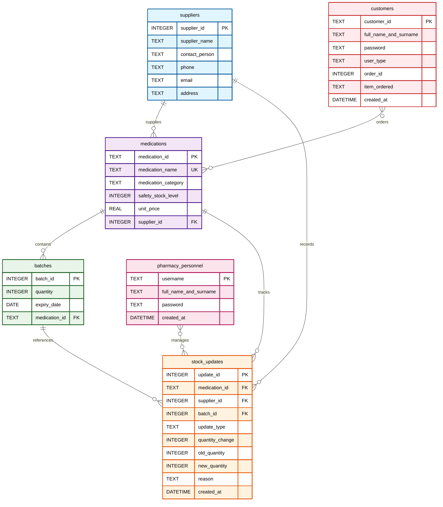

# Group-11-BFB321-Semester-Project
## Group Members

| Name | Student Number |
|--------------------|---------------|
| Rorisang Dithato   | u22594168     |
| Zhaneley Perry     | u23606488     |
| Courtney Newmarch  | u23531089     |
| Tinotenda Mukiwa   | u22750861     |

# Medical Inventory Management System
A web-based pharmaceutical inventory management systems that functions to reduce medicine stockouts in South African healthcare facilities. The system is built with HTML, Bootstrap, CSS and SQLite.

# Features
- Dashboard: A summary view of medication inventory statistics and user activity  
- Order Tracking: A detailed overview of the quantities and delivery dates of orders in the system  
- Product Management: Add, view and remove medications in the system  
- Stock Tracking: Update stock levels with detailed statistics  
- Customer Management: Control customer use and track order histories for predictive analytics  
- Supplier Management: Monitor supplier performance and streamline procurement

# Database Setup
1. Open command prompt/terminal in the project directory
2. Run the SQL commands:  
        sqlite3 Medications.db < Medications.sql

# Database Schema
## Entity Relationship Diagram (ERD)

This Database includes the following tables:    
## Tables
1. __Suppliers__: Medication suppliers
2. **Customers**: Registered customers and their relevant information
3. **Medications**: Contains a variety of medications and their related informartion (category and price)
4. **Batches**: Provides a batch view for ease in medications control (expiry date and quantity)
5. **Pharmacy Personnel**: Details the pharmacy personnel and their user details
6. **Stock Updates**: Tracks medication flow in and out of the system

## Views 
1. __Weekly Deliveries__: view the pending deliveries, completed orders and delayed shipment alerts

# Sample Data
The database includes 2 sample data entries for testing in each table:  
- **2 Pharmacy Personnel**: ZPerry and GMaxulu with their user details
- **2 Suppliers**: Rorisang (MedNet) and Perry (BigPharma), these entries detail the supplier and the industry contact
- **2 Medications**: Efavirenz (category ARV) and Rifampin (category TB)
- **2 Batches**: Details the batch id along with its quantity (100 and 80)
- **2 Stock Updates**: These sample entries detail the update type (add, remove or set) with a reason for the quantity change (eg. "sale")
- **2 Customers**: Court Kadash and Tino Mukiwa along with their respective identity numbers

# File Structure

# Usage
1. Initialize the database using the SQLite command line method above
2. Open LogiTrack.html in your web browser
3. Navigate through the different pages to manage your medication inventory, user data and order creation. The use cases are valid for pharmacy personnel, medication staff and customers.

# Technologies Used
- HTML5: Structure and forms
- Bootstrap 5.3.8: UI framework and styling
- Bootstrap Icons: Icon set
- CSS
- SQLite: Database for data persistence

# Browser Compatibility
The application works with all modern browsers that support HTML5 and CSS3, including:

- Chrome 90+
- Firefox 88+
- Safari 14+
- Edge 90+  

Note: This is a static HTML application. For production use, you would need to add backend functionality for database connectivity and form processing.

   
   

