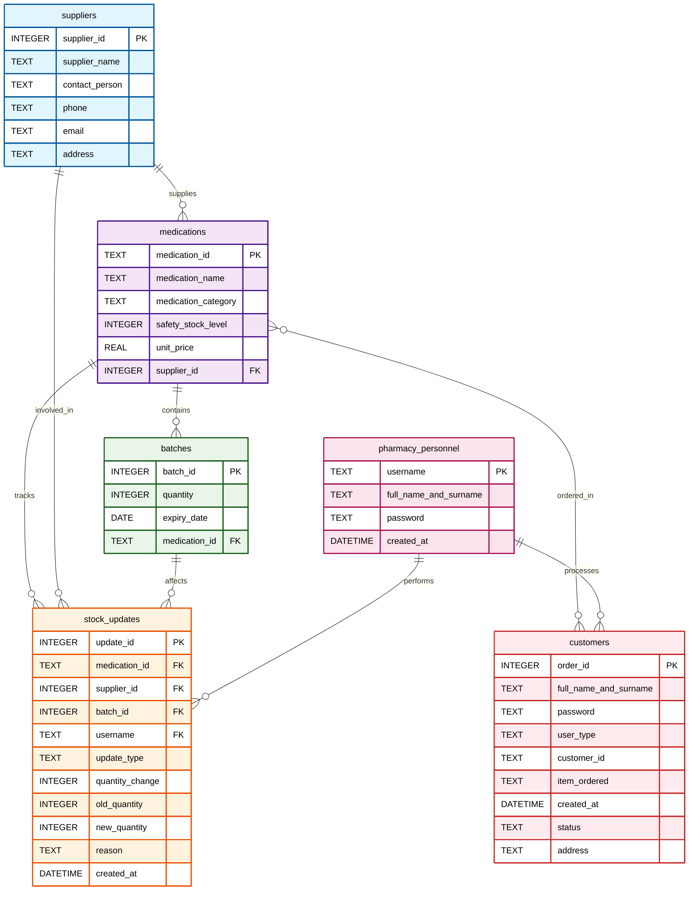

# Group-11-BFB321-Semester-Project
## Group Members

| Name | Student Number | Github username
|--------------------|---------------|-------------------|
| Rorisang Dithato   | u22594168     | Rorisang2004      |
| Zhaneley Perry     | u23606488     | Zhaneley          |
| Courtney Newmarch  | u23531089     | CourtneyNewmarch  |
| Tinotenda Mukiwa   | u22750861     | TMukiwa           |

# Medical Inventory Management System
A web-based pharmaceutical inventory management systems that functions to reduce medicine stockouts in South African healthcare facilities. The system is built with HTML, Bootstrap, CSS and SQLite.

# Features

- **Dashboard**: Real-time summary view of medication inventory statistics, low-stock alerts, and user activity
- **Order Tracking**: Comprehensive overview of order quantities, delivery dates, and status updates (Pending/Delivered)
- **Product Management**: Add, view, edit, and remove medications with batch-level tracking and expiry date monitoring
- **Stock Tracking**: Update stock levels with detailed analytics, safety stock alerts, and inventory valuation
- **Customer Management**: Manage customer profiles, track order histories, and support both internal (medical staff) and external users
- **Supplier Management**: Monitor supplier performance, maintain contact information, and streamline procurement processes
- **Multi-Portal Access**: Separate optimized interfaces for Pharmacy Personnel, Medical Staff, and Customers
- **Prescription Management**: Secure digital prescription upload and management system

# Database Setup
1. Open command prompt/terminal in the project directory
2. Run the SQL commands:  
        sqlite3 Medications.db < Medications.sql

# Database Schema
## Entity Relationship Diagram (ERD)

```mermaid  
erDiagram
    suppliers {
        INTEGER supplier_id PK
        TEXT supplier_name
        TEXT contact_person
        TEXT phone
        TEXT email
        TEXT address
    }

    medications {
        TEXT medication_id PK
        TEXT medication_name
        TEXT medication_category
        INTEGER safety_stock_level
        REAL unit_price
        INTEGER supplier_id FK
    }

    batches {
        INTEGER batch_id PK
        INTEGER quantity
        DATE expiry_date
        TEXT medication_id FK
    }

    pharmacy_personnel {
        TEXT username PK
        TEXT full_name_and_surname
        TEXT password
        DATETIME created_at
    }

    stock_updates {
        INTEGER update_id PK
        TEXT medication_id FK
        INTEGER supplier_id FK
        INTEGER batch_id FK
        TEXT username FK
        TEXT update_type
        INTEGER quantity_change
        INTEGER old_quantity
        INTEGER new_quantity
        TEXT reason
        DATETIME created_at
    }

    customers {
        INTEGER order_id PK
        TEXT full_name_and_surname
        TEXT password
        TEXT user_type
        TEXT customer_id
        TEXT item_ordered
        DATETIME created_at
        TEXT status
        TEXT address
    }

    suppliers ||--o{ medications : supplies
    medications ||--o{ batches : contains
    medications ||--o{ stock_updates : tracks
    suppliers ||--o{ stock_updates : involved_in
    batches ||--o{ stock_updates : affects
    pharmacy_personnel ||--o{ stock_updates : performs
    medications }o--o{ customers : "ordered_in"
    pharmacy_personnel ||--o{ customers : processes

    %% Color Styling
    classDef suppliers fill:#e1f5fe,stroke:#01579b,stroke-width:2px,color:#000
    classDef medications fill:#f3e5f5,stroke:#4a148c,stroke-width:2px,color:#000
    classDef batches fill:#e8f5e8,stroke:#1b5e20,stroke-width:2px,color:#000
    classDef stock_updates fill:#fff3e0,stroke:#e65100,stroke-width:2px,color:#000
    classDef customers fill:#ffebee,stroke:#c62828,stroke-width:2px,color:#000
    classDef pharmacy_personnel fill:#fce4ec,stroke:#ad1457,stroke-width:2px,color:#000
    
    class suppliers suppliers
    class medications medications
    class batches batches
    class stock_updates stock_updates
    class customers customers
    class pharmacy_personnel pharmacy_personnel
```

# This Database includes the following tables:    
## Tables
1. __Suppliers__: Certified medication suppliers/vendors
2. **Customers**: Registered customers/medical personell and their relevant information
3. **Medications**: Contains a variety of medications and their related informartion (category and price)
4. **Batches**: Provides a batch view for ease in medications control (expiry date and quantity)
5. **Pharmacy Personnel**: Details the pharmacy personnel and their user details
6. **Stock Updates**: Tracks medication flow in and out of the system

## Views 
1. __Weekly Deliveries__: view the pending deliveries, completed orders and delayed shipment alerts

# Sample Data
The database includes 2 sample data entries for testing in each table:  
- **2 Pharmacy Personnel**: ZPerry and GMaxulu with their user details
- **2 Suppliers**: Rorisang (MedNet) and Perry (BigPharma), these entries detail the supplier and the industry contact
- **2 Medications**: Efavirenz (category ARV) and Rifampin (category TB)
- **2 Batches**: Details the batch id along with its quantity (100 and 80)
- **2 Stock Updates**: These sample entries detail the update type (add, remove or set) with a reason for the quantity change (eg. "sale")
- **2 Customers**: Court Kadash and Tino Mukiwa along with their respective identity numbers

# File Structure
├── add_item.html              # Add new medications 

├── add_prescriptions.html     # Add customer prescriptions 

├── customerLogin.html         # Customer login page  

├── Customers.html             # Customer registration page 

├── edit_item.html             # Edit medications  

├── Frontpage.html             # Main dashboard/ Home page 

├── manage_suppliers.html      # Add new suppliers

├── MedicalStaff.html          # Medical staff registration page  

├── medicalStaffLogin.html     # Medical staff login page  

├── Pharmacy.html              # Pharmacy personnel registration page 

├── pharmacyLogin.html         # Pharmacy personnel login page  

├── place_order1.html          # Page 1 for customer order placements  

├── place_order2.html          # Page 2 for medical staff order placement  

├── privacy_policy.html        # Privacy policy page  

├── remove_item.html           # Remove medications from the system  

├── terms_of_service.html      # Service terms page  

├── view_suppliers.html        # View all current suppliers in database 

├── Medications.sql            # Database schema and sample data  

├── Medications.db             # SQLite database (created after running setup)  

├── styles.css                 # CSS styles file  

├── signup.html                # Signup page

├── app.py                     # Backend file

└── README.md                  # This file  
